# Praktikum1_DDL

# SQL DDL (Data Definition Language)

1. Buat sebuah database dengan nama **latihan1!**
```sh
CREATE DATABASE latihan01;
```
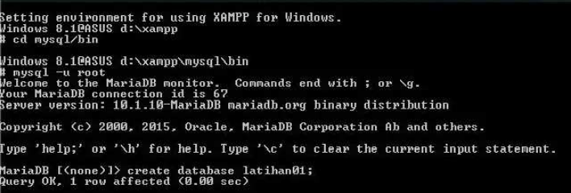 <br>

2. Buat sebuah tabel dengan nama **biodata** dengan field nama dan alamat pada database **latihan01!**
```sh
use latihan01;
create table biodata (
nama varchar (15)not null,
alamat varchar (50) not null );
```
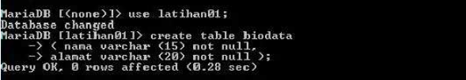 <br>

ketik desc biodata;
<br>

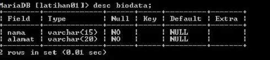<br>

3. Tambahkan sebuah kolom **keterangan** (varchar 15), sebagai kolom terakhir!
```sh
alter table biodata
add keterangan varchar (15) not null;
```

<br>
ketik  desc biodata; 

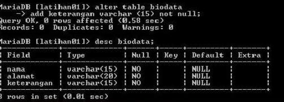
<br>

4. Tambahkan kolom **id** (int 11) di awal (sebagai kolom pertama)!
```sh
alter table biodata
add id int (11) null first;
```

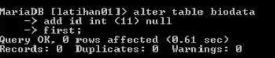<br>

ketik desc biodata;

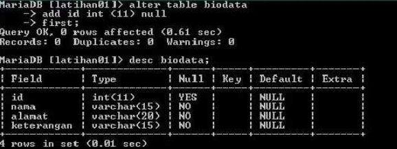<br>

5. Siapkan sebuah kolom dengan nama **phone** (varchar 15) setelah kolom alamat!
```sh
alter table biodata
add column
phone varchar (15) not null
after alamat;
```
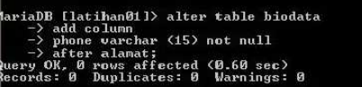<br>

ketik desc biodata

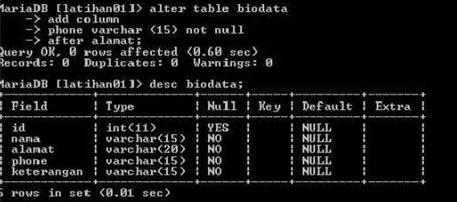<br>

6. Ubah kolom id menjadi char(11)!
```sh
alter table biodata
modify id chart (11) null;
```

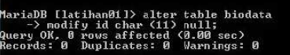<br>

ketik desc biodata;

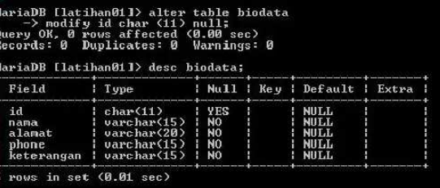<br>

7. Ubah nama kolom **phone** menjadi **hp** (varchar 20)!
```sh
alter table biodata
change phone hp varchar (20) not null;
```
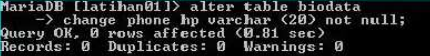<br>

ketik desc biodata;

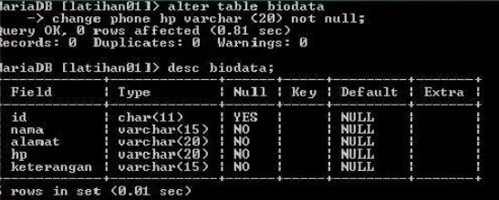<br>

8. Hapus kolom **keterangan** dari tabel!
```sh
alter table biodata
drop keterangan;
```
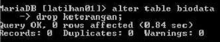<br>

ketik desc biodata;

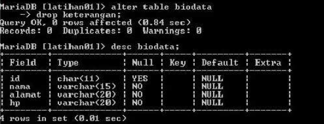<br>

9. Ganti nama tabel menjadi **data_mahasiswa!**
```sh
rename table biodata to data_mahasiswa;
```
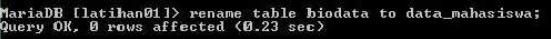<br>

10. Ganti nama **field** id menjadi **nim!**
```sh
alter table data_mahasiswa
change is nia char (11) null;
```
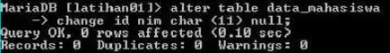<br>

ketik desc data_mahasiswa;

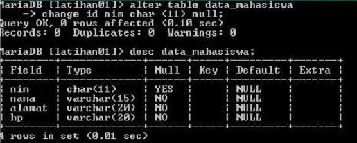<br>

11. Jadikan nim sebagai primary key!
```sh
alter table data_mahasiswa add primary key (nim);
```
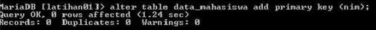<br>

ketik desc data_mahasiswa;

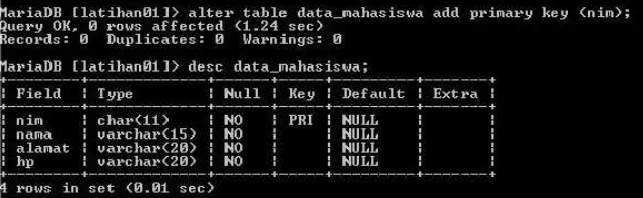<br>


# FINISH